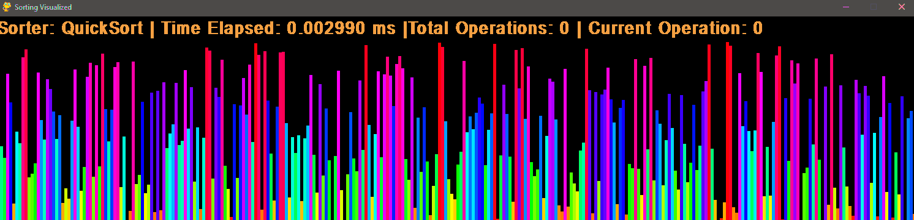
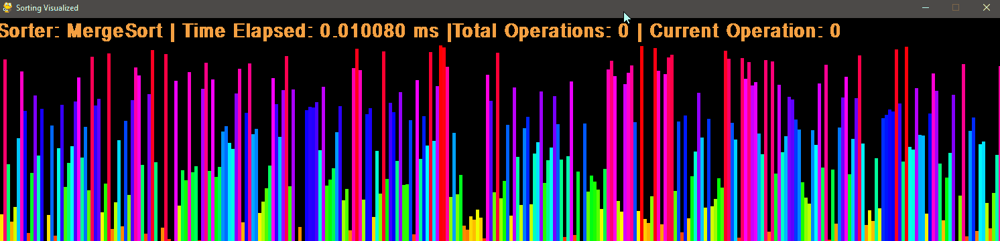

# Sortvisual_Python
## Intro
A simple visualization of four sorting algorithms in a framework that allows for the easy addition of others

Each algorithm is a subclass of sorter which documents each switch of elements in a FIFO datastructure.

## Usage
````
spacebar:   randomize
return:     sort/resume
esc:        pause
1-4:        select algorithm
````
## Demo
Each of the following clips have been taken using <s>600</s> 599 items.
I didnt let the algorithms run on the same dataset so the performance in ms shouldnt be compared directly.
This demo only serves to demonstrate how each algorithm works.

### InsertionSort


### BubbleSort


### QuickSort


### MergeSort


## TODO
- Add more algorithms
- allow for static data (not just random)
- allow for arraysize change in runtime
- add menu 
- dynamic window scalling
- sound effects?
- Sorting lines of a Picture instead of Different height bars